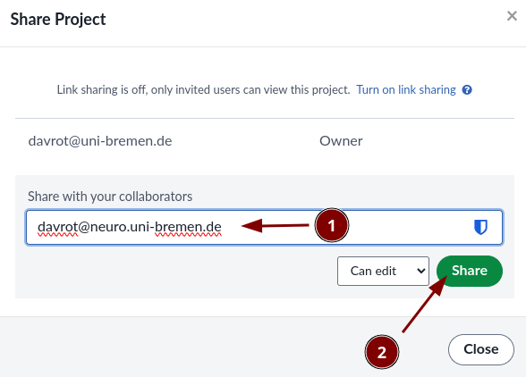
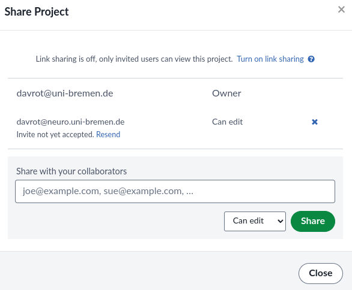
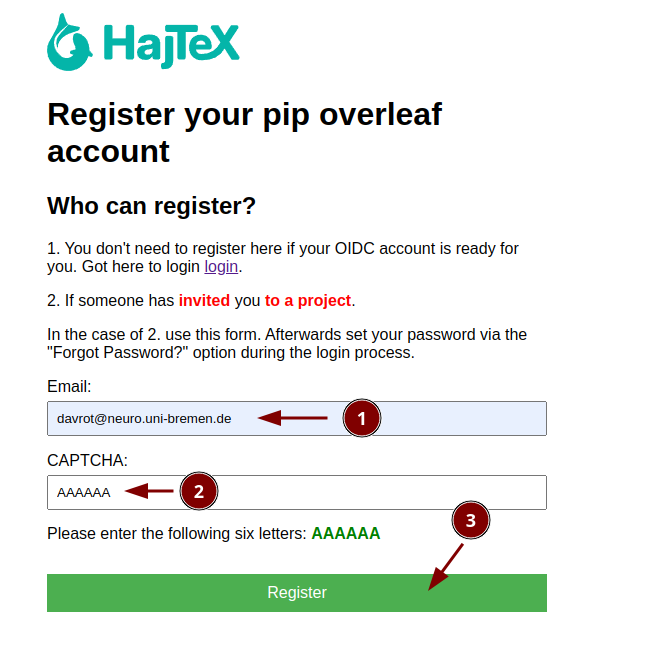
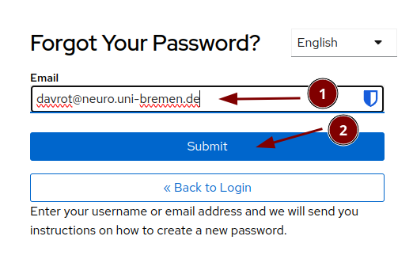
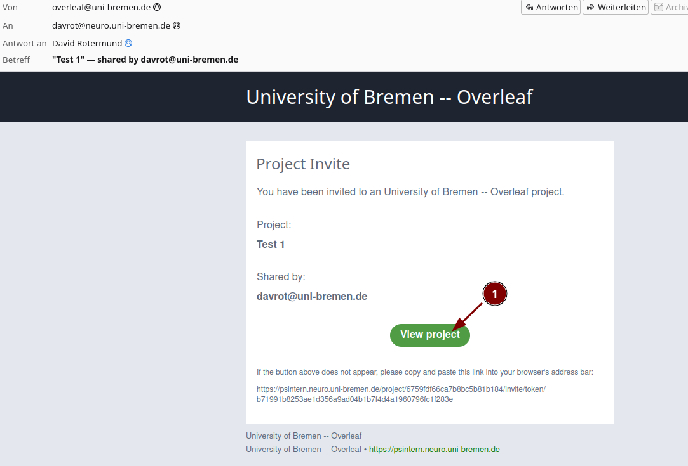
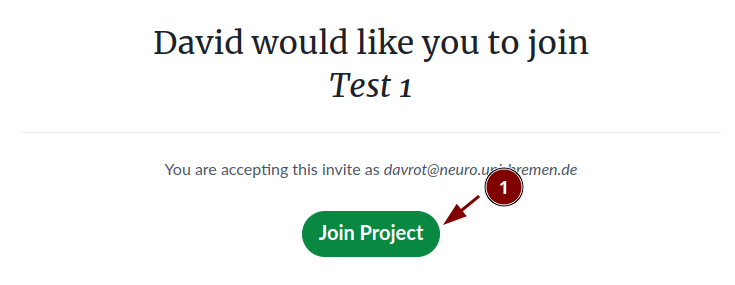

# Assumptions

1. You system is docker ready.
2. You have a working DNS entry and you have non-selfsigned SSL certificates
3. We assume that a ufw firewall is used. And port 443 is open.
```
ufw allow 443
```

# Notes 

1. All the docker container will be placed during this installation at /docker/.... .
2. Make absolutely sure that the Fully Qualified Domain Name (FQDN) is **NOT** in the /etc/hosts of the server.


# Preparations

Install pip for python

```
>> apt -y install python3-pip python3-strictyaml
```

## Docker (Ubuntu)

```
apt update
apt upgrade

apt -y install git pkg-config libssl-dev curl mc argon2 ca-certificates net-tools

apt -y install iptables-persistent

install -m 0755 -d /etc/apt/keyrings

curl -fsSL https://download.docker.com/linux/ubuntu/gpg -o /etc/apt/keyrings/docker.asc

chmod a+r /etc/apt/keyrings/docker.asc

echo \
  "deb [arch=$(dpkg --print-architecture) signed-by=/etc/apt/keyrings/docker.asc] https://download.docker.com/linux/ubuntu \
  $(. /etc/os-release && echo "$VERSION_CODENAME") stable" | \
  sudo tee /etc/apt/sources.list.d/docker.list > /dev/null
  
apt-get update
  
apt-get -y install docker-ce docker-ce-cli containerd.io docker-buildx-plugin docker-compose-plugin

echo "{" > /etc/docker/daemon.json
echo '  "iptables": false' >> /etc/docker/daemon.json 
echo "}" >> /etc/docker/daemon.json  

systemctl restart docker

sed -i -e 's/DEFAULT_FORWARD_POLICY="DROP"/DEFAULT_FORWARD_POLICY="ACCEPT"/g' /etc/default/ufw
ufw reload
iptables -t nat -A POSTROUTING ! -o docker0 -s 172.18.0.0/16 -j MASQUERADE

ufw allow in on docker0
ufw route allow in on docker0
ufw route allow out on docker0

netfilter-persistent save

docker run hello-world
```

## eMail 

```
# Add root to the /etc/aliases file and add the msmtprc file to /etc
apt -y install msmtp msmtp-mta mailutils
hostname [FQDN]
cat /etc/hostname
vi /etc/msmtprc
chmod 644 /etc/msmtprc
touch /var/log/msmtp.log
chmod 666 /var/log/msmtp.log
# ln -s /usr/bin/msmtp /usr/sbin/sendmail

# echo "Test message" | mail -s "Test subject" root
```

## Firewall

```
ufw allow 443
ufw allow 80
```

# Ready the docker networks

We will have to networks keycloak-network and 

```
docker network create keycloak-network
snetz=`docker network inspect keycloak-network | grep "Subnet"  | sed s/" "/""/g | sed s/"\,"/""/g | sed s/":"/"\n"/g  | grep -v "Subnet" | sed s/'"'/''/g`
nid=`docker network ls | grep keycloak-network | awk '{print $1}'`

ufw allow in on br-$nid
ufw route allow in on br-$nid
ufw route allow out on br-$nid
iptables -t nat -A POSTROUTING ! -o br-$nid -s $snetz -j MASQUERADE
```

```
docker network create overleaf-network
snetz=`docker network inspect overleaf-network | grep "Subnet"  | sed s/" "/""/g | sed s/"\,"/""/g | sed s/":"/"\n"/g  | grep -v "Subnet" | sed s/'"'
nid=`docker network ls | grep overleaf-network | awk '{print $1}'`

ufw allow in on br-$nid
ufw route allow in on br-$nid
ufw route allow out on br-$nid
iptables -t nat -A POSTROUTING ! -o br-$nid -s $snetz -j MASQUERADE
```
Check if this worked:

```
>> docker network ls
NETWORK ID     NAME               DRIVER    SCOPE
[...]
8e4e9f6eba80   keycloak-network   bridge    local
acc1f3aff0b7   overleaf-network   bridge    local
```
(The number is front are different for every installation.)

```
>> ufw status | grep 8e4e9f6eba80
Anywhere on br-8e4e9f6eba80 ALLOW       Anywhere                  
Anywhere (v6) on br-8e4e9f6eba80 ALLOW       Anywhere (v6)             
Anywhere                   ALLOW FWD   Anywhere on br-8e4e9f6eba80
Anywhere on br-8e4e9f6eba80 ALLOW FWD   Anywhere                  
Anywhere (v6)              ALLOW FWD   Anywhere (v6) on br-8e4e9f6eba80
Anywhere (v6) on br-8e4e9f6eba80 ALLOW FWD   Anywhere (v6)
```

```
>> ufw status | grep acc1f3aff0b7
Anywhere on br-acc1f3aff0b7 ALLOW       Anywhere                  
Anywhere (v6) on br-acc1f3aff0b7 ALLOW       Anywhere (v6)             
Anywhere                   ALLOW FWD   Anywhere on br-acc1f3aff0b7
Anywhere on br-acc1f3aff0b7 ALLOW FWD   Anywhere                  
Anywhere (v6)              ALLOW FWD   Anywhere (v6) on br-acc1f3aff0b7
Anywhere (v6) on br-acc1f3aff0b7 ALLOW FWD   Anywhere (v6)
```
# Docker keycloak's postgres (/docker/compose/keycloakpostgres)

The .env file needs to be edited. Fix POSTGRES_PASSWORD=REDACTED with a real password. 

Then start the container with 
```
>> sh up.sh
```

Check the logs if everthing went well:
```
>> sh logs.sh
[...]
keycloakpostgres  | 2024-12-07 17:37:18.844 UTC [1] LOG:  starting PostgreSQL 16.6 (Debian 16.6-1.pgdg120+1) on x86_64-pc-linux-gnu, compiled by gcc (Debian 12.2.0-14) 12.2.0, 64-bit
keycloakpostgres  | 2024-12-07 17:37:18.845 UTC [1] LOG:  listening on IPv4 address "0.0.0.0", port 5432
keycloakpostgres  | 2024-12-07 17:37:18.845 UTC [1] LOG:  listening on IPv6 address "::", port 5432
keycloakpostgres  | 2024-12-07 17:37:18.911 UTC [1] LOG:  listening on Unix socket "/var/run/postgresql/.s.PGSQL.5432"
keycloakpostgres  | 2024-12-07 17:37:18.981 UTC [65] LOG:  database system was shut down at 2024-12-07 17:37:18 UTC
keycloakpostgres  | 2024-12-07 17:37:19.017 UTC [1] LOG:  database system is ready to accept connections
```

# Docker keycloak (/docker/compose/keycloakserver)

The .env file needs to be edited. 
- Fix POSTGRES_PASSWORD=REDACTED with same password used for the keycloakpostgres container.
- Fix KEYCLOAK_ADMIN_PASSWORD=REDACTED with a new password.
- Fix KEYCLOAK_HOSTNAME=YOUR_HOSTNAME with your fully qualified domain name.

Then start the container with 
```
>> sh up.sh
```

Check the logs if everthing went well (give it time...):

```
>> sh logs.sh
[...]
keycloakserver  | 2024-12-07 17:52:23,717 INFO  [io.quarkus] (main) Keycloak 26.0.7 on JVM (powered by Quarkus 3.15.1) started in 39.709s. Listening on: http://0.0.0.0:8080. Management interface listening on http://0.0.0.0:9000.
keycloakserver  | 2024-12-07 17:52:23,718 INFO  [io.quarkus] (main) Profile prod activated. 
keycloakserver  | 2024-12-07 17:52:23,718 INFO  [io.quarkus] (main) Installed features: [agroal, cdi, hibernate-orm, jdbc-postgresql, keycloak, narayana-jta, opentelemetry, reactive-routes, rest, rest-jackson, smallrye-context-propagation, smallrye-health, vertx]
```

# Docker proxy (/docker/compose/nginx)

You need your SSL certificates here.  
* Put the **public** certificate and the root ca certifcate chain together in /docker/compose/nginx/ca.pem
* Put the **private** certificate in /docker/compose/nginx/key.pem

We will go through several nginx.conf files because we can not start the proxy if the services its will proxy are not availabe. Thus we start with nginx_a.conf (containing only the keycloak).
```
>> cp nginx_a.conf nginx.conf
>> sh up.sh
```

Check the logs if everthing went well (give it time...):

```
>> sh logs.sh
[...]
nginx  | /docker-entrypoint.sh: Sourcing /docker-entrypoint.d/15-local-resolvers.envsh
nginx  | /docker-entrypoint.sh: Launching /docker-entrypoint.d/20-envsubst-on-templates.sh
nginx  | /docker-entrypoint.sh: Launching /docker-entrypoint.d/30-tune-worker-processes.sh
nginx  | /docker-entrypoint.sh: Configuration complete; ready for start up
```

# First configurations of KeyCloak (26.0)

Login under:
```
https://FQDN/sso
e.g.
https://psintern.neuro.uni-bremen.de/sso
```

---

The password is the one you put in /docker/compose/keycloakserver/.env at KEYCLOAK_ADMIN_PASSWORD.


---

We switch to login with email (If you allow password recovery via "Forgot password" is your decision): 


## Create your own admin user and replace the temporary one

Create a new user


---

Fill in the user details


---

Set the password


---


---


---

Elevate the user to admin status


---


---


---

**Later** (!!!!) when everything is working as intended, delete the temporary admin user


---

Log out as admin and login with your new admin user


---


## Set the email server parameter of keycloak

Obviously use your own values: 


---


---

Test if the email is working:


## Configure the event logging

Event listeners


---


---

User events settings


---

Admin events settings


## Localization


---


# Creating the overleaf client in Keycloak and test it

Create a new keycloak client for overleaf


---

Name it overleaf


---

Activate "Client authentication"


---

The callback url is required. We will use the test tool url first and replace it later. The test tool helps to find a potential problem easier. 


---

Now get the secret of the overleaf client


---


## Setting up and using the test tool in /docker/develop/test_keycloak_overleaf_client

This might seem as a waste of time but I will spare a lot of tears.

* Go to /docker/develop/test_keycloak_overleaf_client
* Build the test container
```
>> sh make_image.sh
```
* Modifiy get_info.sh such that those values are correct (you remember the secret from the overleaf client a few moments ago?):
  - FQDN="psintern.neuro.uni-bremen.de"
  - OIDC_CLIENT_ID=overleaf
  - OIDC_CLIENT_SECRET=REDACTED
* run get_info.sh
```
>> sh get_info.sh
```
* start the container
```
>> sh up.sh
```

* We check the logs if everthing is file:

```
>> sh logs.sh
nodedev  | > node app.js
nodedev  | 
nodedev  | Server running on port 3000
nodedev  | Keycloak OpenID Connect Test Application
nodedev  | Base Path: /nodedev
nodedev  | Callback URL: https://FQDN/nodedev/login/callback
```

* We open the firewall (port 3000)

```
>> sh open_firewall.sh
```

* Reconfigure nginx
  - go to /docker/compose/nginx and change the config to nginx_b.conf
```
>> sh down.sh
>> cp nginx_b.conf nginx.conf
>> sh up.sh
```
* Check the logs if it is ready
```
>> sh logs.sh
nginx  | 10-listen-on-ipv6-by-default.sh: info: Enabled listen on IPv6 in /etc/nginx/conf.d/default.conf
nginx  | /docker-entrypoint.sh: Sourcing /docker-entrypoint.d/15-local-resolvers.envsh
nginx  | /docker-entrypoint.sh: Launching /docker-entrypoint.d/20-envsubst-on-templates.sh
nginx  | /docker-entrypoint.sh: Launching /docker-entrypoint.d/30-tune-worker-processes.sh
nginx  | /docker-entrypoint.sh: Configuration complete; ready for start up
```
* Use a web browser to surf to https://FQDN/nodedev/
  


---


* Go to /docker/develop/test_keycloak_overleaf_client and check the log file
```
>> sh logs.sh
nodedev  | 172.20.0.1 - - [07/Dec/2024:23:44:01 +0000] "GET /nodedev/profile HTTP/1.0" 304 - "-" "Mozilla/5.0 (X11; Linux x86_64) AppleWebKit/537.36 (KHTML, like Gecko) Chrome/131.0.0.0 Safari/537.36"
nodedev  | Deserializing user: {
nodedev  |   id: '00f32e59-be6e-435b-9f1a-6312c1cbcd19',
nodedev  |   displayName: 'David Rotermund',
nodedev  |   username: 'davrot@uni-bremen.de',
nodedev  |   name: { familyName: 'Rotermund', givenName: 'David' },
nodedev  |   emails: [ { value: 'davrot@uni-bremen.de' } ]
nodedev  | }
nodedev  | 172.20.0.1 - - [07/Dec/2024:23:44:35 +0000] "GET /nodedev/ HTTP/1.0" 200 183 "https://psintern.neuro.uni-bremen.de/nodedev/profile" "Mozilla/5.0 (X11; Linux x86_64) AppleWebKit/537.36 (KHTML, like Gecko) Chrome/131.0.0.0 Safari/537.36"
```

* If there is no error we can disable the test program.
* Go to /docker/develop/test_keycloak_overleaf_client and stop the test container
```
>> sh down.sh
```

* Run this twice to remove the open ports (IPv4 and IPv6) and answer with y
```
>> ufw status numbered | grep 3000 | head -1 | sed s/'\['/''/g | sed s/'\]'/''/g | awk -c {'print "ufw delete " $1'} > close_firewall_todo.sh
>> sh close_firewall_todo.sh
```

* Clean up the proxy config in /docker/compose/nginx

```
>> sh down.sh
>> cp nginx_a.conf nginx.conf
>> sh up.sh
```
# Docker container overleaf's mongo db (/docker/compose/overleafmongo)

* Go the mongo db directory /docker/compose/overleafmongo
* Start the container via
```
>> sh up.sh
```

* Check the logs if it is healthy (give it some time for the first start, but it looks like there is no steady state to wait for)
```
>> sh logs.sh
```

```
>> docker ps
CONTAINER ID   IMAGE                            COMMAND                  CREATED             STATUS                   PORTS       
55f1febfb50a   mongo:6.0                        "docker-entrypoint.s…"   8 minutes ago       Up 7 minutes (healthy)   27017/tcp                                                       overleafmongo
[...]
```

# Docker container overleaf's redis (/docker/compose/overleafredis)

* Go the redis directory /docker/compose/overleafredis
* Start the container via
```
>> sh up.sh
```

* Check the logs if it is healthy
```
>> sh logs.sh
overleafredis  | 1:C 08 Dec 2024 01:31:03.442 # oO0OoO0OoO0Oo Redis is starting oO0OoO0OoO0Oo
overleafredis  | 1:C 08 Dec 2024 01:31:03.442 # Redis version=6.2.14, bits=64, commit=00000000, modified=0, pid=1, just started
overleafredis  | 1:C 08 Dec 2024 01:31:03.442 # Configuration loaded
overleafredis  | 1:M 08 Dec 2024 01:31:03.443 # Server initialized
overleafredis  | 1:M 08 Dec 2024 01:31:03.443 # WARNING Memory overcommit must be enabled! Without it, a background save or replication may fail under low memory condition. Being disabled, it can can also cause failures without low memory condition, see https://github.com/jemalloc/jemalloc/issues/1328. To fix this issue add 'vm.overcommit_memory = 1' to /etc/sysctl.conf and then reboot or run the command 'sysctl vm.overcommit_memory=1' for this to take effect.
```

```
>> docker ps
CONTAINER ID   IMAGE                            COMMAND                  CREATED             STATUS                   PORTS                                                           NAMES
5d29d4f246ce   redis:6.2-alpine                 "docker-entrypoint.s…"   2 minutes ago       Up 2 minutes (healthy)   6379/tcp                                                        overleafredis
[...]
```

# Docker Container Overleaf (/docker/compose/overleafserver) - First start

* Go into /docker/compose/

* Get the tex live container

```
>> sh pull_texlive.sh
```

* Modify get_info.sh in /docker/compose/overleafserver . Fix the following parameters:
    - FQDN
    - OIDC_CLIENT_ID
    - OIDC_CLIENT_SECRET
    - OVERLEAF_EMAIL_PASSWORD
    - OVERLEAF_EMAIL_FROM_ADDRESS
    - OVERLEAF_EMAIL_SMTP_HOST
    - OVERLEAF_EMAIL_SMTP_PORT
    - OVERLEAF_EMAIL_SMTP_SECURE
    - OVERLEAF_EMAIL_SMTP_USER
    - OVERLEAF_APP_NAME
    - OVERLEAF_NAV_TITLE
    - OVERLEAF_CUSTOM_EMAIL_FOOTER

* Then create the .env file via:
```
>> sh get_info.sh
```
* Start the overleaf container
```
>> sh up.sh
```  

* Look at the logs (takes some time):
```
>> sh logs.sh
overleafserver  | Done.
overleafserver  | Flushing log queue.
overleafserver  | No recovery of doc versions needed.
overleafserver  | *** Booting runit daemon...
overleafserver  | *** Runit started as PID 182
overleafserver  | >> Setting permissions on docker socket
overleafserver  | Dec  8 02:19:35 overleafserver cron[195]: (CRON) INFO (pidfile fd = 3)
overleafserver  | Dec  8 02:19:35 overleafserver cron[195]: (CRON) INFO (Running @reboot jobs)
overleafserver  | Dec  8 02:20:01 overleafserver CRON[374]: (root) CMD ( /overleaf/cron/delete-projects.sh >> /var/log/overleaf/cron-delete-projects.log 2>&1)
overleafserver  | Dec  8 02:20:01 overleafserver CRON[375]: (root) CMD ( /overleaf/cron/project-history-periodic-flush.sh >> /var/log/overleaf/cron-project-history-periodic-flush.log 2>&1)
```

* Go into the proxy directory /docker/compose/nginx and switch to config C:

```
>> sh down.sh
>> cp nginx_c.conf nginx.conf
>> sh up.sh
```
* Look at the logs:
```
>> sh logs.sh
nginx  | 10-listen-on-ipv6-by-default.sh: info: Enabled listen on IPv6 in /etc/nginx/conf.d/default.conf
nginx  | /docker-entrypoint.sh: Sourcing /docker-entrypoint.d/15-local-resolvers.envsh
nginx  | /docker-entrypoint.sh: Launching /docker-entrypoint.d/20-envsubst-on-templates.sh
nginx  | /docker-entrypoint.sh: Launching /docker-entrypoint.d/30-tune-worker-processes.sh
nginx  | /docker-entrypoint.sh: Configuration complete; ready for start up
```
## The overleaflaunchpad https://FQDN/launchpad

* Go to the URL https://FQDN/launchpad with a web browser
* Enter your admin user email address and passwort into the fields.

---

* Login with the admin credentials


---

* Now we are redirected to the true launchpad page


---

* Test if the system is able to send email correctly


# Preperation of the main container

Go to /docker/compose/overleafserver and edit the file build_env.sh

```
FQDN="psintern.neuro.uni-bremen.de"

# KeyCloak
OIDC_CLIENT_ID=overleaf
OIDC_CLIENT_SECRET=REDACTED
OIDC_ENABLE=true
OIDC_NAME_SHORT="OIDC"
OIDC_NAME_LONG="OIDC"

# Email
OVERLEAF_EMAIL_PASSWORD=REDACTED
OVERLEAF_EMAIL_FROM_ADDRESS=overleaf@uni-bremen.de
OVERLEAF_EMAIL_SMTP_HOST=smtp.uni-bremen.de
OVERLEAF_EMAIL_SMTP_PORT=465
OVERLEAF_EMAIL_SMTP_SECURE=true
OVERLEAF_EMAIL_SMTP_USER=overleaf

# Other
OVERLEAF_APP_NAME="University of Bremen -- Overleaf"
OVERLEAF_NAV_TITLE="Uni Bremen Overleaf"
OVERLEAF_CUSTOM_EMAIL_FOOTER="University of Bremen -- Overleaf"
```

Make sure that you are happy with the settings and then run

```
>> sh build_env.sh
```

Please check the /docker/compose/overleafserver/.env that comes out of the process. 

# Activate HajTex branding -==- MANDATORY -==- (/docker/features/hajtex-branding)

```
>> cd /docker/features/hajtex-branding
>> sh enable_feature.sh
```

# Activate Disable Community Survey Fix (/docker/features/disable-community-survey)

```
>> cd /docker/features/disable-community-survey
>> sh enable_feature.sh
```

To re-enable it: 
```
>> cd /docker/features/disable-community-survey
>> sh disable_feature.sh
```

# Activate Shell Escape (/docker/features/shell-escape)

This feature is important for several often used latex packages. However, it should only be used in conjunction with TexLive docker container for compiling latex. Luckily, the use of TexLive docker container is the default setting for the main container. 

```
>> cd /docker/features/shell-escape
>> sh enable_feature.sh
```

To disable it: 
```
>> cd /docker/features/shell-escape
>> sh disable_feature.sh
```

# Activate Tracking of changes and comments (/docker/features/track-changes)

```
>> cd /docker/features/track-changes
>> sh enable_feature.sh
```

To disable it: 
```
>> cd /docker/features/track-changes
>> sh disable_feature.sh
```

# Activate Symbol Palette (/docker/features/symbol-palette)

```
>> cd /docker/features/symbol-palette
>> sh enable_feature.sh
```

To disable it: 
```
>> cd /docker/features/symbol-palette
>> sh disable_feature.sh
```

# Activate Reference bib plugin (/docker/features/references)

```
>> cd /docker/features/references
>> sh enable_feature.sh
```

To disable it: 
```
>> cd /docker/features/references
>> sh disable_feature.sh
```

# Activate OICD feature (/docker/features/oidc)

We need to fix the callback link int keycloak to https://FQDN/login/oidc/callback


---


---

```
>> cd /docker/features/oidc
>> sh enable_feature.sh
```

To disable it: 
```
>> cd /docker/features/oidc
>> sh disable_feature.sh
```

## Activate login-page modification (/docker/features/login-page)

You want to modify /5.2.1/overleaf/services/web/app/views/user/login.pug such that I will look like you want it..

```
>> cd /docker/features/login-page
>> sh enable_feature.sh
```

To disable it: 
```
>> cd /docker/features/login-page
>> sh disable_feature.sh
```


## Make a HajTex user into an admin

For this we use the tools in /docker/compose/check_users .

Preparations: 
```
>> cd /docker/compose/check_users
>> sh make_image.sh
>> sh up.sh
```

This elevates a user with the email davrot@uni-bremen.de to an admin:
```
>> sh exec_make_admin.sh davrot@uni-bremen.de
```
The result is: 
```
User name: davrot@uni-bremen.de
User status was: False
User status changed
```

If you do it again, it informs you that it was already okay:
```
User name: davrot@uni-bremen.de
User status was: True
User status changed
```
Before 


after a logout and login cycle we see: 


### Other tools in /docker/compose/check_users

You can delete a user with the email davrot@uni-bremen.de
```
>> sh delete_user.sh davrot@uni-bremen.de
```

This shows you all the invited user:
```
> sh exec_list_invited.sh
```

And this shows you all the registered users:
```
sh exec_list_user.sh
```

# Restart the container

```
>> cd /docker/compose/overleafserver
>> up.sh
```

# Prepare the register container for externals (/docker/compose/overleafregister/data)

## Keycloak: Set up service user


---


---


---


---


---


---


---


---

## Keycloak: Modify admin-cli client 


---


---


---

## Prepare the register container (/docker/compose/overleafregister)

First of all, build the docker image: 

```
>> sh make_image.sh
```

* Build the docker image with make_image.sh
* In data you need to edit the following files:
  * allowed_domains.json: This allows to configure domains endings (like uni-bremen.de which allows davrot@uni-bremen.de and davrot@neuro.uni-bremen.de) that are automatically allowed even if the person is not invited.
  * blocked_users.json: Here you can name email addresses you want to block.
  * config.json: Here you need to adapt the FQDNs and the two passwords:
```
{
    "keycloak_url": "https://psintern.neuro.uni-bremen.de/sso",
    "keycloak_login": "https://psintern.neuro.uni-bremen.de/login/oidc",
    "admin_username": "automation@non.no",
    "admin_password": "REDACTED",
    "client_id": "admin-cli",
    "client_secret": "REDACTED"
}
```
 * Set a secret key in data/secret_key.json. 

About the code itself: 

* In data/main.py: (pip install captcha flask email_validator pymongo)
  * I simplied the captcha to 6x A . If you want something else change line 34.
  * I am not using the generated captcha_image in the webpage. I thing modern machine learning makes no difference if it is a image or a text. I am using the captcha just to block simple bots. They cannot create an account anyhow. But if you want to, you can add it back to in templates/post.html in by using the "image"
```

```
  * Change keycloak_url to your installation

* And finally change the logos in data/static and the text in templates/post.html

Start the container with:

```
>> sh up.sh
```

Or for development environment activate the 
```
entrypoint: ["sh", "-c", "sleep infinity"]
```
in the compose.yaml. Then enter the container with 
```
>> sh exec.sh
```
Inside the container you can use
```
>> cd data
>> sh run.sh
```
to start the server. Every change in the code, html file or logos requires run.sh to be stopped and started again!

## Activate Register Button (/docker/features/registration-page)

```
>> cd /docker/features/registration-page
>> sh enable_feature.sh
```

To disable it: 
```
>> cd /docker/features/registration-page
>> sh disable_feature.sh
```

## Inviting an external user

We invite a user via the share function in one of the LaTex projects:


---



---



---

The user gets and email and goes to the register page:



---


---



---


---


---


---

Join the project



---



---


---
